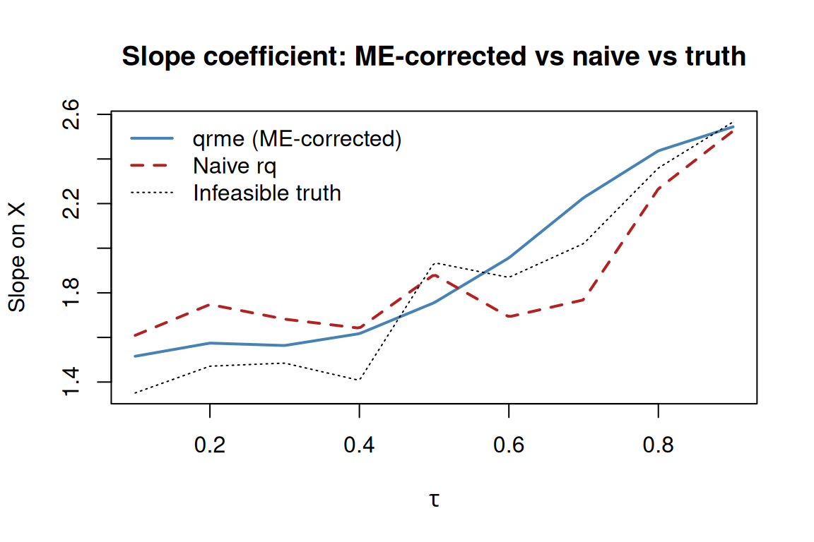

# Introduction to qrme: Quantile Regression with Measurement Error

## Overview

The **qrme** package estimates quantile regression (QR) models when the
dependent variable is measured with error. Classical QR applied to noisy
outcomes produces biased estimates of the conditional quantile function
of the true (latent) outcome.
[`qrme()`](https://bcallaway11.github.io/qrme/reference/qrme.md)
corrects this bias via a pseudo-EM algorithm that alternates between

1.  **E-step** — drawing latent true outcomes given the observed noisy
    outcome and current QR parameters, using Metropolis–Hastings MCMC;
    and
2.  **M-step** — re-fitting quantile regressions on the augmented data.

For the case where *both* the outcome and a continuous treatment
variable are measured with error, see
[`vignette("tsme-application")`](https://bcallaway11.github.io/qrme/articles/tsme-application.md),
which describes
[`tsme()`](https://bcallaway11.github.io/qrme/reference/tsme.md).

## A simulated example

### Data-generating process

We use a location-scale DGP where the true outcome $Y^{*}$ depends on a
uniform covariate $X$:

$$Y^{*} = \beta_{0}(U) + \beta_{1}(U)\, X,\quad U \sim \text{Uniform}(0,1),$$

$$\beta_{0}(u) = 1 + 3u - u^{2},\qquad\beta_{1}(u) = e^{u}.$$

The observed outcome is $Y = Y^{*} + V$, where
$V \sim N(0,\sigma_{V}^{2})$ with $\sigma_{V} = 0.5$.

``` r
library(qrme)
library(quantreg)
#> Loading required package: SparseM

n   <- 400
tau <- seq(0.10, 0.90, by = 0.10)

# true coefficient functions
b0 <- function(u) 1 + 3 * u - u^2
b1 <- function(u) exp(u)

X     <- runif(n)
U     <- runif(n)
Ystar <- b0(U) + b1(U) * X          # latent outcome
V     <- rnorm(n, sd = 0.5)         # measurement error
Y     <- Ystar + V                   # observed (noisy) outcome

dd <- data.frame(Y = Y, Ystar = Ystar, X = X)
```

### Naive QR ignoring measurement error

Standard [`rq()`](https://rdrr.io/pkg/quantreg/man/rq.html) applied to
the noisy outcome is inconsistent for the QR coefficients of $Y^{*}$.

``` r
fit_naive <- rq(Ystar ~ X, tau = tau, data = dd)   # infeasible truth
fit_noisy <- rq(Y     ~ X, tau = tau, data = dd)   # naive, ignores ME

# slope coefficients at each tau
rbind(
  truth  = coef(fit_naive)["X", ],
  noisy  = coef(fit_noisy)["X", ]
)
#>       tau= 0.1 tau= 0.2 tau= 0.3 tau= 0.4 tau= 0.5 tau= 0.6 tau= 0.7 tau= 0.8
#> truth 1.351121 1.471110 1.484967 1.407494 1.935130 1.869018 2.020751 2.359464
#> noisy 1.609179 1.747803 1.682019 1.641558 1.881682 1.692509 1.768411 2.266146
#>       tau= 0.9
#> truth 2.565987
#> noisy 2.525466
```

The naive estimates are systematically attenuated relative to the truth
because additive ME compresses the conditional distribution.

### ME-corrected QR with `qrme()`

[`qrme()`](https://bcallaway11.github.io/qrme/reference/qrme.md) takes a
standard formula interface. Key arguments:

| Argument          | Default      | Purpose                                           |
|-------------------|--------------|---------------------------------------------------|
| `tau`             | `0.5`        | quantile(s) to estimate                           |
| `n_mix`           | `1`          | number of Gaussian components for ME distribution |
| `me_distribution` | `"gaussian"` | `"gaussian"` or `"laplace"`                       |
| `mcmc_draws`      | `200`        | MCMC draws per E-step                             |
| `mcmc_burn_in`    | `100`        | burn-in draws (discarded)                         |
| `tol`             | `0.01`       | convergence tolerance                             |
| `max_em_iters`    | `100`        | maximum EM iterations                             |
| `se`              | `FALSE`      | compute bootstrap standard errors?                |
| `n_boot`          | `100`        | bootstrap replications (if `se = TRUE`)           |

``` r
fit_me <- qrme(
  formula      = Y ~ X,
  data         = dd,
  tau          = tau,
  n_mix        = 1L,
  mcmc_draws   = 150L,
  mcmc_burn_in = 75L,
  tol          = 1e-2,
  max_em_iters = 30L,
  se           = FALSE,
  verbose      = FALSE
)
#> Warning in rq.fit.pfn(wx, wy, tau = tau, ...): Too many fixups: doubling m
#> Warning in rq.fit.pfn(wx, wy, tau = tau, ...): Too many fixups: doubling m
#> Warning in rq.fit.pfn(wx, wy, tau = tau, ...): Too many fixups: doubling m
#> Warning in rq.fit.pfn(wx, wy, tau = tau, ...): Too many fixups: doubling m
#> Warning in rq.fit.pfn(wx, wy, tau = tau, ...): Too many fixups: doubling m
#> Warning in rq.fit.pfn(wx, wy, tau = tau, ...): Too many fixups: doubling m
#> Warning in rq.fit.pfn(wx, wy, tau = tau, ...): Too many fixups: doubling m
#> Warning in rq.fit.pfn(wx, wy, tau = tau, ...): Too many fixups: doubling m
#> Warning in rq.fit.pfn(wx, wy, tau = tau, ...): Too many fixups: doubling m
#> Warning in rq.fit.pfn(wx, wy, tau = tau, ...): Too many fixups: doubling m
#> Warning in rq.fit.pfn(wx, wy, tau = tau, ...): Too many fixups: doubling m
#> Warning in rq.fit.pfn(wx, wy, tau = tau, ...): Too many fixups: doubling m
#> Warning in rq.fit.pfn(wx, wy, tau = tau, ...): Too many fixups: doubling m
#> Warning in rq.fit.pfn(wx, wy, tau = tau, ...): Too many fixups: doubling m
#> Warning in rq.fit.pfn(wx, wy, tau = tau, ...): Too many fixups: doubling m
#> Warning in rq.fit.pfn(wx, wy, tau = tau, ...): Too many fixups: doubling m
#> Warning in rq.fit.pfn(wx, wy, tau = tau, ...): Too many fixups: doubling m
#> Warning in rq.fit.pfn(wx, wy, tau = tau, ...): Too many fixups: doubling m
#> Warning in rq.fit.pfn(wx, wy, tau = tau, ...): Too many fixups: doubling m
#> Warning in rq.fit.pfn(wx, wy, tau = tau, ...): Too many fixups: doubling m
#> Warning in rq.fit.pfn(wx, wy, tau = tau, ...): Too many fixups: doubling m
#> Warning in rq.fit.pfn(wx, wy, tau = tau, ...): Too many fixups: doubling m
```

The result is an object of class `merr`. Printing it shows the estimated
measurement error distribution:

``` r
print(fit_me)
#> Measurement error: gaussian
#>  Pi Mu  Sigma
#>   1  0 0.6107
```

### Coefficient estimates

The QR coefficient matrix lives in `fit_me$bet`. Rows correspond to
`tau` values; columns to regression coefficients (intercept first).

``` r
# intercept and slope at each quantile
colnames(fit_me$bet) <- c("intercept", "slope_X")
round(fit_me$bet, 3)
#>          intercept slope_X
#> tau= 0.1     1.556   1.516
#> tau= 0.2     1.647   1.575
#> tau= 0.3     1.814   1.564
#> tau= 0.4     2.017   1.617
#> tau= 0.5     2.206   1.756
#> tau= 0.6     2.319   1.956
#> tau= 0.7     2.395   2.226
#> tau= 0.8     2.454   2.437
#> tau= 0.9     2.519   2.544
```

Use [`betfun()`](https://bcallaway11.github.io/qrme/reference/betfun.md)
to get a smooth interpolating function over the unit interval, which is
useful for plotting the full quantile process:

``` r
bf    <- betfun(fit_me$bet, tau)
tau_g <- seq(0.10, 0.90, length.out = 200)

# betfun returns a function over scalar tau; sapply to vectorise
# coef() on a multi-tau rq object is (coefs x tau); transpose for betfun
slope_me    <- sapply(tau_g, function(u) bf(u)[2])
bf_noisy    <- betfun(t(coef(fit_noisy)), tau)
slope_noisy <- sapply(tau_g, function(u) bf_noisy(u)[2])
bf_truth    <- betfun(t(coef(fit_naive)), tau)
slope_truth <- sapply(tau_g, function(u) bf_truth(u)[2])

plot(
  tau_g, slope_me,
  type = "l", lwd = 2, col = "steelblue",
  ylim = range(slope_me, slope_noisy, slope_truth),
  xlab = expression(tau), ylab = "Slope on X",
  main = "Slope coefficient: ME-corrected vs naive vs truth"
)
lines(tau_g, slope_noisy, col = "firebrick", lwd = 2, lty = 2)
lines(tau_g, slope_truth, col = "black",     lwd = 1, lty = 3)
legend("topleft",
  legend = c("qrme (ME-corrected)", "Naive rq", "Infeasible truth"),
  col    = c("steelblue", "firebrick", "black"),
  lty    = c(1, 2, 3), lwd = c(2, 2, 1), bty = "n"
)
```



The ME-corrected estimates track the truth substantially better than the
naive estimates, especially at extreme quantiles.

### Recovering the measurement error distribution

The EM algorithm simultaneously estimates the ME distribution. With a
single-component Gaussian specification (`n_mix = 1`), the estimated
parameters are:

``` r
cat(sprintf(
  "ME distribution: %s\n  pi = %.3f   mu = %.3f   sigma = %.3f\n",
  fit_me$me_distribution, fit_me$pi, fit_me$mu, fit_me$sig
))
#> ME distribution: gaussian
#>   pi = 1.000   mu = 0.000   sigma = 0.611
cat("True sigma_V = 0.5\n")
#> True sigma_V = 0.5
```

### Finite Gaussian mixtures (`n_mix > 1`)

For more flexible ME distributions, increase `n_mix`. With `n_mix = 2`
the EM fits a two-component mixture:

``` r
fit_m2 <- qrme(
  formula      = Y ~ X,
  data         = dd,
  tau          = tau,
  n_mix        = 2L,
  mcmc_draws   = 150L,
  mcmc_burn_in = 75L,
  tol          = 1e-2,
  max_em_iters = 30L,
  se           = FALSE,
  verbose      = FALSE
)
#> Warning in rq.fit.pfn(wx, wy, tau = tau, ...): Too many fixups: doubling m
#> Warning in rq.fit.pfn(wx, wy, tau = tau, ...): Too many fixups: doubling m
#> Warning in rq.fit.pfn(wx, wy, tau = tau, ...): Too many fixups: doubling m
#> Warning in rq.fit.pfn(wx, wy, tau = tau, ...): Too many fixups: doubling m
#> Warning in rq.fit.pfn(wx, wy, tau = tau, ...): Too many fixups: doubling m
#> Warning in rq.fit.pfn(wx, wy, tau = tau, ...): Too many fixups: doubling m
#> Warning in rq.fit.pfn(wx, wy, tau = tau, ...): Too many fixups: doubling m
#> Warning in rq.fit.pfn(wx, wy, tau = tau, ...): Too many fixups: doubling m
#> Warning in rq.fit.pfn(wx, wy, tau = tau, ...): Too many fixups: doubling m
#> Warning in rq.fit.pfn(wx, wy, tau = tau, ...): Too many fixups: doubling m
#> Warning in rq.fit.pfn(wx, wy, tau = tau, ...): Too many fixups: doubling m
#> Warning in rq.fit.pfn(wx, wy, tau = tau, ...): Too many fixups: doubling m
#> Warning in rq.fit.pfn(wx, wy, tau = tau, ...): Too many fixups: doubling m
#> Warning in rq.fit.pfn(wx, wy, tau = tau, ...): Too many fixups: doubling m
#> Warning in rq.fit.pfn(wx, wy, tau = tau, ...): Too many fixups: doubling m
#> Warning in rq.fit.pfn(wx, wy, tau = tau, ...): Too many fixups: doubling m
#> Warning in rq.fit.pfn(wx, wy, tau = tau, ...): Too many fixups: doubling m
#> Warning in rq.fit.pfn(wx, wy, tau = tau, ...): Too many fixups: doubling m
#> Warning in rq.fit.pfn(wx, wy, tau = tau, ...): Too many fixups: doubling m
#> Warning in rq.fit.pfn(wx, wy, tau = tau, ...): Too many fixups: doubling m
#> Warning in rq.fit.pfn(wx, wy, tau = tau, ...): Too many fixups: doubling m
#> Warning in rq.fit.pfn(wx, wy, tau = tau, ...): Too many fixups: doubling m
#> Warning in rq.fit.pfn(wx, wy, tau = tau, ...): Too many fixups: doubling m
#> Warning in rq.fit.pfn(wx, wy, tau = tau, ...): Too many fixups: doubling m
#> Warning in rq.fit.pfn(wx, wy, tau = tau, ...): Too many fixups: doubling m
#> Warning in rq.fit.pfn(wx, wy, tau = tau, ...): Too many fixups: doubling m
#> Warning in rq.fit.pfn(wx, wy, tau = tau, ...): Too many fixups: doubling m
#> Warning in rq.fit.pfn(wx, wy, tau = tau, ...): Too many fixups: doubling m
#> Warning in rq.fit.pfn(wx, wy, tau = tau, ...): Too many fixups: doubling m
#> Warning in rq.fit.pfn(wx, wy, tau = tau, ...): Too many fixups: doubling m
#> Warning in rq.fit.pfn(wx, wy, tau = tau, ...): Too many fixups: doubling m
#> Warning in rq.fit.pfn(wx, wy, tau = tau, ...): Too many fixups: doubling m
#> Warning in rq.fit.pfn(wx, wy, tau = tau, ...): Too many fixups: doubling m
#> Warning in rq.fit.pfn(wx, wy, tau = tau, ...): Too many fixups: doubling m
#> Warning in rq.fit.pfn(wx, wy, tau = tau, ...): Too many fixups: doubling m
#> Warning in rq.fit.pfn(wx, wy, tau = tau, ...): Too many fixups: doubling m
#> Warning in rq.fit.pfn(wx, wy, tau = tau, ...): Too many fixups: doubling m
#> Warning in rq.fit.pfn(wx, wy, tau = tau, ...): Too many fixups: doubling m
#> Warning in rq.fit.pfn(wx, wy, tau = tau, ...): Too many fixups: doubling m
#> Warning in rq.fit.pfn(wx, wy, tau = tau, ...): Too many fixups: doubling m
#> Warning in rq.fit.pfn(wx, wy, tau = tau, ...): Too many fixups: doubling m
#> Warning in rq.fit.pfn(wx, wy, tau = tau, ...): Too many fixups: doubling m
#> Warning in rq.fit.pfn(wx, wy, tau = tau, ...): Too many fixups: doubling m
#> Warning in rq.fit.pfn(wx, wy, tau = tau, ...): Too many fixups: doubling m
#> Warning in rq.fit.pfn(wx, wy, tau = tau, ...): Too many fixups: doubling m
#> Warning in rq.fit.pfn(wx, wy, tau = tau, ...): Too many fixups: doubling m
#> Warning in rq.fit.pfn(wx, wy, tau = tau, ...): Too many fixups: doubling m
#> Warning in rq.fit.pfn(wx, wy, tau = tau, ...): Too many fixups: doubling m
#> Warning in rq.fit.pfn(wx, wy, tau = tau, ...): Too many fixups: doubling m
#> Warning in rq.fit.pfn(wx, wy, tau = tau, ...): Too many fixups: doubling m
#> Warning in rq.fit.pfn(wx, wy, tau = tau, ...): Too many fixups: doubling m
#> Warning in rq.fit.pfn(wx, wy, tau = tau, ...): Too many fixups: doubling m
#> Warning in rq.fit.pfn(wx, wy, tau = tau, ...): Too many fixups: doubling m
#> Warning in rq.fit.pfn(wx, wy, tau = tau, ...): Too many fixups: doubling m
#> Warning in rq.fit.pfn(wx, wy, tau = tau, ...): Too many fixups: doubling m
#> Warning in rq.fit.pfn(wx, wy, tau = tau, ...): Too many fixups: doubling m
#> Warning in rq.fit.pfn(wx, wy, tau = tau, ...): Too many fixups: doubling m
#> Warning in rq.fit.pfn(wx, wy, tau = tau, ...): Too many fixups: doubling m
#> Warning in rq.fit.pfn(wx, wy, tau = tau, ...): Too many fixups: doubling m
#> Warning in rq.fit.pfn(wx, wy, tau = tau, ...): Too many fixups: doubling m
#> Warning in rq.fit.pfn(wx, wy, tau = tau, ...): Too many fixups: doubling m
#> Warning in rq.fit.pfn(wx, wy, tau = tau, ...): Too many fixups: doubling m
#> Warning in rq.fit.pfn(wx, wy, tau = tau, ...): Too many fixups: doubling m
#> Warning: EM algorithm failed to converge after 30 iterations
print(fit_m2)
#> Measurement error: gaussian (n_mix = 2)
#>            Pi      Mu  Sigma
#> Comp.1 0.5301 -0.5906 0.4842
#> Comp.2 0.4699  0.6664 0.3234
```

Model selection between mixture orders can be done via
[`AIC()`](https://rdrr.io/r/stats/AIC.html) /
[`BIC()`](https://rdrr.io/r/stats/AIC.html), which call the
[`logLik.merr()`](https://bcallaway11.github.io/qrme/reference/logLik.merr.md)
S3 method:

``` r
data.frame(
  n_mix = c(1, 2),
  AIC   = c(AIC(fit_me), AIC(fit_m2)),
  BIC   = c(BIC(fit_me), BIC(fit_m2))
)
#>   n_mix      AIC      BIC
#> 1     1 1184.047 1255.367
#> 2     2 1226.329 1315.904
```

### Bootstrap standard errors

Set `se = TRUE` and choose `n_boot` to obtain percentile bootstrap SEs.
This adds `$bet.se`, `$sig.se`, `$mu.se`, and `$pi.se` to the returned
object. Bootstrap is omitted here because it is slow; a typical call
looks like:

``` r
fit_se <- qrme(
  formula      = Y ~ X,
  data         = dd,
  tau          = tau,
  n_mix        = 1L,
  mcmc_draws   = 200L,
  mcmc_burn_in = 100L,
  se           = TRUE,
  n_boot       = 200L,
  n_cores      = 4L     # parallelise across bootstrap replications
)
print(fit_se)           # shows SEs alongside point estimates
```

### Multi-start estimation

The EM algorithm is not globally convergent and can settle at local
optima.
[`qrme_start_search()`](https://bcallaway11.github.io/qrme/reference/qrme_start_search.md)
runs the estimator from multiple random starting values and returns the
best fit by log-likelihood:

``` r
best <- qrme_start_search(
  formula     = Y ~ X,
  data        = dd,
  tau         = tau,
  n_starts    = 10,
  sigma_range = c(0.05, 1.5),
  n_mix       = 1L,
  mcmc_draws  = 200L
)
```

## Summary

[`qrme()`](https://bcallaway11.github.io/qrme/reference/qrme.md)
provides a straightforward interface for ME-corrected quantile
regression. The workflow is:

1.  Specify the model with a formula and choose `tau`.
2.  Choose the ME distribution (`n_mix`, `me_distribution`).
3.  Tune the MCMC (`mcmc_draws`, `mcmc_burn_in`, `proposal_sd`) and EM
    (`tol`, `max_em_iters`) settings.
4.  Optionally add bootstrap SEs (`se = TRUE`).
5.  Use
    [`betfun()`](https://bcallaway11.github.io/qrme/reference/betfun.md)
    for smooth coefficient curves and
    [`AIC()`](https://rdrr.io/r/stats/AIC.html)/[`BIC()`](https://rdrr.io/r/stats/AIC.html)
    for mixture-order selection.

For the two-sided ME extension (ME in both the outcome and a continuous
treatment) see
[`vignette("tsme-application")`](https://bcallaway11.github.io/qrme/articles/tsme-application.md).
