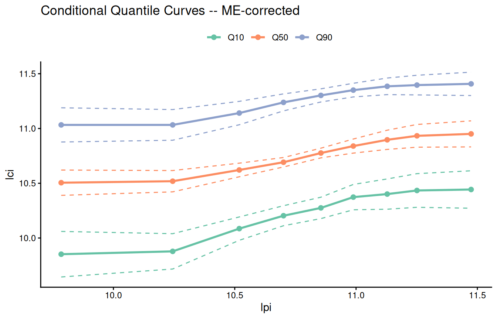
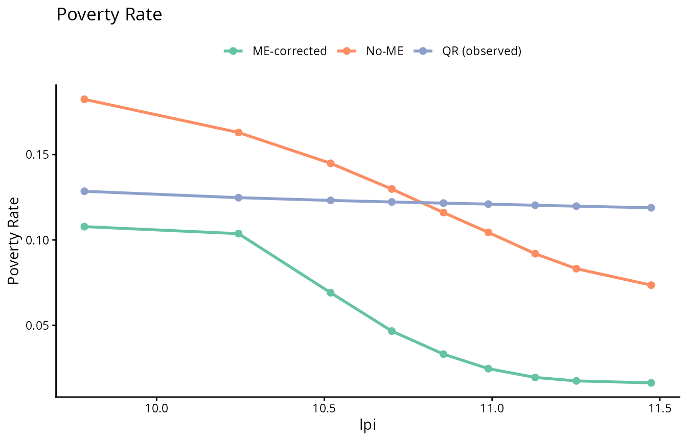

# Two-Sided Measurement Error: Intergenerational Income Mobility

## Overview

This vignette illustrates
[`tsme()`](https://bcallaway11.github.io/qrme/reference/tsme.md), the
two-sided measurement error estimator in the **qrme** package, using the
intergenerational income mobility application from Callaway, Li,
Murtazashvili, and Tsyawo (2026). The key idea is that when *both* the
outcome (child income) and a continuous treatment (father’s income) are
measured with error, standard quantile regression estimates of the
conditional distribution of child income given father’s income are
biased. [`tsme()`](https://bcallaway11.github.io/qrme/reference/tsme.md)
corrects this bias by:

1.  Running
    [`qrme()`](https://bcallaway11.github.io/qrme/reference/qrme.md)
    separately for the child income and father income equations to
    recover ME-corrected conditional quantile functions.
2.  Linking the two via a copula to recover the joint distribution of
    latent (true) child and father incomes.
3.  Deriving mobility statistics from the corrected joint distribution.

## The NLSY97 data

The `nlsy97` dataset contains 1,066 father-son pairs from the National
Longitudinal Survey of Youth 1997. Key variables:

| Variable  | Description                 |
|-----------|-----------------------------|
| `lci`     | Log son’s annual income     |
| `lpi`     | Log father’s annual income  |
| `ageC_97` | Son’s age in 1997           |
| `ageF`    | Father’s age                |
| `educF`   | Father’s years of schooling |

``` r
library(qrme)
library(ggplot2)

dim(nlsy97)
#> [1] 1096   16
summary(nlsy97[, c("lci", "lpi", "ageC_97", "ageF", "educF")])
#>       lci              lpi            ageC_97           ageF      
#>  Min.   : 2.485   Min.   : 1.085   Min.   :12.00   Min.   :23.00  
#>  1st Qu.:10.309   1st Qu.:10.391   1st Qu.:13.00   1st Qu.:37.00  
#>  Median :10.758   Median :10.855   Median :14.00   Median :41.00  
#>  Mean   :10.663   Mean   :10.644   Mean   :14.21   Mean   :41.52  
#>  3rd Qu.:11.156   3rd Qu.:11.212   3rd Qu.:15.00   3rd Qu.:45.00  
#>  Max.   :12.267   Max.   :12.515   Max.   :17.00   Max.   :67.00  
#>      educF      
#>  Min.   : 2.00  
#>  1st Qu.:12.00  
#>  Median :13.00  
#>  Mean   :13.32  
#>  3rd Qu.:16.00  
#>  Max.   :20.00
```

Raw (observed) incomes are measured with substantial error — NLSY97
income data are self-reported and subject to recall error, rounding, and
misclassification.

## Fitting the model with `tsme()`

The call below reproduces the main specification from the paper: a Frank
copula, Laplace measurement error distribution, and one mixture
component for each equation. Age controls enter both the child income
and father income equations.

``` r
tau     <- seq(0.02, 0.98, length.out = 25)
t_values <- quantile(nlsy97$lpi, probs = seq(0.1, 0.9, by = 0.1))

set.seed(51526)
fit <- tsme(
  data            = nlsy97,
  y_formula       = lci ~ ageC_97 + ageF,
  t_formula       = lpi ~ ageC_97 + ageF,
  tau             = tau,
  t_values        = t_values,
  y_n_mix         = 1L,
  t_n_mix         = 1L,
  copula          = "frank",
  me_distribution = "laplace",
  conv_patience   = 1L,
  n_copula_me_draws = 1000L,
  mcmc_draws      = 400L,
  mcmc_burn_in    = 20L,
  conv_criterion  = "params",
  tol             = 1e-2,
  max_em_iters    = 100L,
  se              = TRUE,
  n_boot          = 200L,
  n_cores         = 10L,
  boot_n_copula_me_draws = 500L,
  boot_mcmc_draws = 200L,
  boot_mcmc_burn_in = 10L,
  boot_tol        = 5e-2,
  verbose         = 2
)
```

This call takes roughly 90 minutes with 10 cores. For the remainder of
this vignette we load the pre-computed result bundled with the package:

``` r
fit <- nlsy97_tsme_fit
```

## Printing the result

[`print()`](https://rdrr.io/r/base/print.html) shows the copula
parameter and measurement error distribution for each equation,
comparing the ME-corrected estimator against a no-ME benchmark:

``` r
print(fit)
#> Two-Sided Measurement Error Model (tsme)
#> ------------------------------------------
#> Outcome:    lci ~ ageC_97 + ageF 
#> Treatment:  lpi ~ ageC_97 + ageF 
#> 
#> Copula: frank      theta(ME) = 2.1152 (SE 0.6443) | theta(No-ME) = 1.3026 (SE 0.2153)
#> 
#> ME parameters:
#>   Y (laplace): sigma = 0.4980 (SE 0.0057)
#>   T (laplace): sigma = 0.4837 (SE 0.0075)
#> 
#> Spearman's rho:  ME = 0.3664 (SE 0.0798) | No-ME = 0.2295 (SE 0.0330) | Obs = 0.2085 (SE 0.0289)
```

[`summary()`](https://rdrr.io/r/base/summary.html) adds the ME-corrected
transition matrix and upward mobility estimates:

``` r
summary(fit)
#> Two-Sided Measurement Error Model (tsme)
#> ------------------------------------------
#> Outcome:    lci ~ ageC_97 + ageF 
#> Treatment:  lpi ~ ageC_97 + ageF 
#> 
#> Copula: frank      theta(ME) = 2.1152 (SE 0.6443) | theta(No-ME) = 1.3026 (SE 0.2153)
#> 
#> ME parameters:
#>   Y (laplace): sigma = 0.4980 (SE 0.0057)
#>   T (laplace): sigma = 0.4837 (SE 0.0075)
#> 
#> Spearman's rho:  ME = 0.3664 (SE 0.0798) | No-ME = 0.2295 (SE 0.0330) | Obs = 0.2085 (SE 0.0289)
#> 
#> Upward Mobility:
#>                 ME  ME_se   NoME NoME_se Observed Obs_se
#> Q1 (bottom) 0.7836 0.0211 0.8264  0.0084   0.8303 0.0181
#> Q2          0.5756 0.0112 0.5897  0.0058   0.5725 0.0253
#> Q3          0.4218 0.0119 0.4054  0.0060   0.3868 0.0288
#> Q4 (top)    0.2071 0.0207 0.1771  0.0081   0.1667 0.0248
#> 
#> Transition Matrix (ME-corrected, rows=father, cols=son):
#>                 Q1     Q2     Q3     Q4
#> Q1 (bottom) 0.4231 0.2809 0.1848 0.1113
#> Q2          0.2802 0.2889 0.2479 0.1830
#> Q3          0.1836 0.2476 0.2865 0.2823
#> Q4 (top)    0.1131 0.1826 0.2808 0.4235
```

## Measurement error parameters

The EM algorithm estimates the ME standard deviation for each equation.
With a Laplace distribution and one component, the key parameter is
$\sigma_{V}$:

``` r
cat(sprintf(
  "Child income equation  — sigma_V = %.4f  (SE = %.4f)\n",
  fit$me_qyx$sig, fit$me_qyx$sig_se
))
#> Child income equation  — sigma_V = 0.4980  (SE = 0.0057)
cat(sprintf(
  "Father income equation — sigma_V = %.4f  (SE = %.4f)\n",
  fit$me_qtx$sig, fit$me_qtx$sig_se
))
#> Father income equation — sigma_V = 0.4837  (SE = 0.0075)
```

Both equations show substantial measurement error: the ME standard
deviation is roughly 0.50 log-income units (~50% in levels), indicating
that self-reported income data are quite noisy.

## Copula and rank correlation

The Frank copula parameter and the implied Spearman rank correlation
summarise intergenerational dependence:

``` r
cat(sprintf(
  "Frank copula parameter: ME = %.3f (SE = %.3f)   No-ME = %.3f\n",
  fit$me_cop_param, fit$me_cop_param_se, fit$nome_cop_param
))
#> Frank copula parameter: ME = 2.115 (SE = 0.644)   No-ME = 1.303
cat(sprintf(
  "Spearman rho:           ME = %.4f (SE = %.4f)   No-ME = %.4f   Observed = %.4f\n",
  fit$me_spearman, fit$me_spearman_se,
  fit$nome_spearman, fit$obs_spearman
))
#> Spearman rho:           ME = 0.3664 (SE = 0.0798)   No-ME = 0.2295   Observed = 0.2085
```

The ME-corrected Spearman rank correlation (0.37) is substantially
larger than the naive observed correlation (0.21), indicating that
measurement error causes a significant downward bias in the apparent
degree of intergenerational persistence.

## Transition matrix

The 4×4 transition matrix gives the probability that a son from father’s
income quartile $j$ ends up in son’s income quartile $i$:

``` r
quart_labels <- c("Q1 (bottom)", "Q2", "Q3", "Q4 (top)")
tmat_tbl <- as.data.frame(round(fit$me_tmat, 3))
colnames(tmat_tbl) <- quart_labels
rownames(tmat_tbl) <- quart_labels
print(tmat_tbl)
#>             Q1 (bottom)    Q2    Q3 Q4 (top)
#> Q1 (bottom)       0.113 0.183 0.281    0.424
#> Q2                0.184 0.248 0.287    0.282
#> Q3                0.280 0.289 0.248    0.183
#> Q4 (top)          0.423 0.281 0.185    0.111
```

The diagonal of the ME-corrected matrix is flatter than the naive
observed matrix, but the off-diagonal persistence is still strong — sons
of high-income fathers are substantially more likely to end up in the
top quartile.

## Upward mobility

Upward mobility measures the fraction of sons whose income rank exceeds
their father’s, by father’s income quartile:

``` r
um_tbl <- data.frame(
  `Father's quartile` = quart_labels,
  `ME-corrected`  = round(fit$me_up_mob,    3),
  `No-ME`         = round(fit$nome_up_mob,  3),
  `Observed`      = round(fit$obs_up_mob,   3),
  check.names = FALSE
)
print(um_tbl, row.names = FALSE)
#>  Father's quartile ME-corrected No-ME Observed
#>        Q1 (bottom)        0.784 0.826    0.830
#>                 Q2        0.576 0.590    0.573
#>                 Q3        0.422 0.405    0.387
#>           Q4 (top)        0.207 0.177    0.167
```

Sons of fathers in the bottom income quartile have the highest
probability of upward mobility, while sons of top-quartile fathers have
the lowest.

## Conditional quantile curves

[`autoplot()`](https://ggplot2.tidyverse.org/reference/autoplot.html)
visualises how the conditional distribution of son’s income varies
across father’s income deciles. The ME-corrected curves spread further
than the naive QR curves, reflecting the attenuation bias that
measurement error induces in standard QR:

``` r
autoplot(fit, type = "cond_quant", which = "me")
```



ME-corrected conditional quantile curves

``` r
# Plot each estimator separately and compare
p_nome <- autoplot(fit, type = "cond_quant", which = "nome", ci = FALSE)
p_qr   <- autoplot(fit, type = "cond_quant", which = "qr",   ci = FALSE)
```

## Poverty rates

The poverty rate is the fraction of sons below a given income threshold,
conditional on father’s income decile. Setting `type = "pov_rate"` and
`which = "all"` overlays all three estimators:

``` r
autoplot(fit, type = "pov_rate", which = "all", ci = FALSE)
```



Poverty rates by father’s income decile

## Model selection

[`tsme_model_select()`](https://bcallaway11.github.io/qrme/reference/tsme_model_select.md)
performs a grid search over copula families (Gaussian, Clayton, Gumbel,
Frank) and ME distributions (Gaussian, Laplace) and returns AIC/BIC for
each combination. This is computationally expensive; a typical call
looks like:

``` r
sel <- tsme_model_select(
  data             = nlsy97,
  y_formula        = lci ~ ageC_97 + ageF,
  t_formula        = lpi ~ ageC_97 + ageF,
  tau              = tau,
  t_values         = t_values,
  me_distributions = "laplace",  # or c("gaussian", "laplace") for full grid
  mcmc_draws       = 400L,
  mcmc_burn_in     = 20L,
  n_cores          = 10L
)
print(sel)
```

## References

Callaway, B., Li, T., Murtazashvili, I., and Tsyawo, E. S. (2026).
*Distributional Effects with Two-Sided Measurement Error: An Application
to Intergenerational Income Mobility.* arXiv:2107.09235.
[doi:10.48550/arXiv.2107.09235](https://doi.org/10.48550/arXiv.2107.09235)
